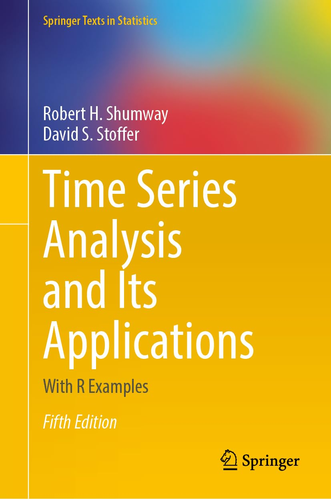

  [__5th Edition coming Jan 2025__](https://link.springer.com/book/9783031705830)

 #### &#10024; Here is [A Road Map](https://nickpoison.github.io/) if you want a broad view of what is available.

  

## tsa5 

- All the  code used in the text  is in [textRcode.md](https://github.com/nickpoison/tsa5/blob/master/textRcode.md)

## astsa

- The home of [astsa - the package for the text](https://github.com/nickpoison/astsa) is here too.

- See the [NEWS](https://github.com/nickpoison/astsa/blob/master/NEWS.md) for further details about the state of the package and the changelog.

- A demonstration of the capabilities of `astsa` can be found here at [**FUN WITH ASTSA**](https://github.com/nickpoison/astsa/blob/master/fun_with_astsa/fun_with_astsa.md)

- Other packages used in the text:

   - Ch 1 - 4: `xts` (`zoo`), `dynlm` (used for a demonstration - not necessary to install)
   - Ch 5 - 7: `xts` (`zoo`), `NTS`, `arfima`, `tseries`, `fGarch`, `TSA`, `vars`, `marima`,`nlme`  (comes with R), `depmixS4`, `MSwM`, `cluster`

## python 

- The code in the first 3 chapters of the  [4th edition](https://github.com/nickpoison/tsa4) text has been [converted to Python.](https://github.com/borisgarbuzov/tsa4-python/tree/master/src)  

- And a [Python package that contains datasets from `astsa` is here.](https://pypi.org/project/astsadata/)

- _Why use Python if you can use R?_ &nbsp; &nbsp; -Mr Natural

&emsp; &ensp;

